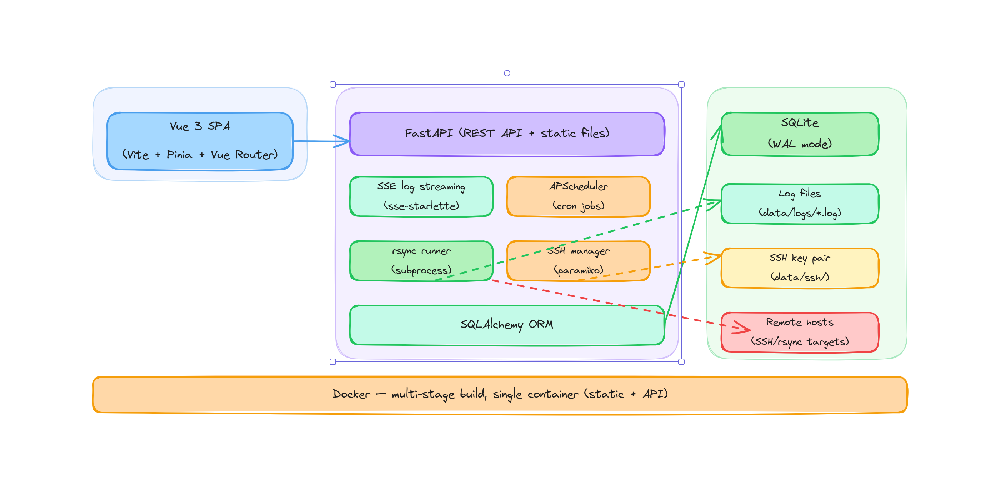

# web-RSync

A web UI for managing rsync tasks — replacement for the unmaintained [websync](https://github.com/furier/websync) project.

## Architecture



> [Open in Excalidraw](https://excalidraw.vertieres.net/#url=https://gitea.vertieres.net/alain/web-RSync/raw/branch/main/docs/architecture.excalidraw)

---

## Features

- Create, schedule, and run rsync tasks via a web UI
- **Dark mode by default** — user-switchable light/dark theme, preference persisted in localStorage
- **Mobile-friendly** — responsive layout with hamburger menu and slide-in sidebar on small screens
- **Material Design Icons** throughout — navigation, action buttons, status indicators
- **Host picker in task form** — source and destination each have a dropdown for pre-configured SSH hosts; entering a path without a host means "local to this server"
- **Mount point panel** — collapsible "Available local paths" panel in the task form lists container mount points with rw/ro badge and fstype; click any path to copy it to the clipboard
- **Inline dry-run test** — validate paths and options before saving, with live log output
- **rsync flag reference** — searchable flag panel with ~60 flags; click to append to options
- **Exclude / include pattern editor** — per-task `--exclude-from` and `--include-from` pattern lists, managed as text fields (no manual file editing)
- **Remote → Remote sync** — both paths as `user@host:/path`; web-RSync SSHes into the source and forwards its agent so rsync authenticates to the destination without the private key leaving the server
- Real-time log streaming over SSE (Server-Sent Events); status badges update live, no reload required
- SSH host management with automated public-key deployment
- Cron scheduling with human-readable previews ([crontab.guru](https://crontab.guru/) linked)
- Job run history with full per-run logs; **purge history** with confirmation
- **Push notifications** on job completion — ntfy, Gotify, Discord, Telegram, any [Apprise-compatible service](https://github.com/caronc/apprise/wiki), or a generic webhook with a custom JSON body template
- Confirmation modal on all destructive actions (delete task, delete host, purge history)
- In-app **Help** page covering all features, path formats, and homelab rsync recipes
- Version badge in sidebar; SPA deep-links (`/history/42`, `/tasks`, etc.) work on direct access / refresh

## Stack

| Layer | Technology |
|-------|-----------|
| Backend | FastAPI + uvicorn |
| Database | SQLite (WAL mode) via SQLAlchemy |
| Scheduling | APScheduler |
| SSH | paramiko |
| Log streaming | SSE via sse-starlette |
| Notifications | [Apprise](https://github.com/caronc/apprise) + httpx |
| Frontend | Vue 3 + Vite + TypeScript + Pinia + Vue Router |
| Icons | Material Design Icons (`@mdi/font` 7.4) |
| Deployment | Docker (multi-stage) |

---

## Deploy on a New System

### Option A — Docker Hub (recommended, no clone needed)

Pull the pre-built image directly from Docker Hub. Only Docker + Compose required.

```bash
mkdir -p /docker/web-rsync/data
cd /docker/web-rsync
```

Create `docker-compose.yml`:

```yaml
services:
  web-rsync:
    image: jabastien/web-rsync:latest
    container_name: web-rsync
    ports:
      - "8000:8000"
    volumes:
      - ./data:/data        # DB, SSH keys, logs — must be persistent
      # - /mnt/nas:/mnt/nas # add host paths rsync needs to reach
    environment:
      - DATA_DIR=/data
      - MAX_CONCURRENT_JOBS=3
      - TZ=UTC                  # set to your timezone, e.g. Europe/Zurich
    restart: unless-stopped
```

```bash
docker compose up -d
curl http://localhost:8000/api/system/health
# → {"status":"ok"}
```

Open `http://<host-ip>:8000`.

To update to the latest image:

```bash
docker compose pull && docker compose up -d
```

---

### Option B — Build from source

**Prerequisites**

| Requirement | Version |
|-------------|---------|
| Docker + Compose plugin | 24+ |
| git | any |
| Node.js *(Proxmox LXC path only)* | 18+ |

**Clone**

```bash
# From GitHub:
git clone https://github.com/jabastien/web-rsync.git
# Or from Gitea:
git clone https://gitea.vertieres.net/alain/web-RSync.git
cd web-rsync
```

**Build and start**

Normal Docker host:

```bash
docker compose up --build -d
```

**Proxmox LXC** (AppArmor blocks `docker build` RUN steps — use the container-commit workaround):

```bash
# Build the Vue frontend first (requires Node.js on the host)
cd frontend && npm install && npm run build && cd ..

# Copy rebuild script to deploy location and run it
cp /docker/web-rsync/rebuild.sh /docker/web-rsync/rebuild.sh   # already present if cloned
/docker/web-rsync/rebuild.sh
```

> If `rebuild.sh` is not yet at `/docker/web-rsync/`, copy it from the repo root:
> ```bash
> cp rebuild.sh /docker/web-rsync/rebuild.sh
> chmod +x /docker/web-rsync/rebuild.sh
> ```

**Verify**

```bash
curl http://localhost:8000/api/system/health
# → {"status":"ok"}
```

Open `http://<host-ip>:8000` in a browser.

**Re-deploying after code changes**

```bash
git pull
# Normal host:
docker compose up --build -d
# Proxmox LXC:
cd frontend && npm run build && cd .. && /docker/web-rsync/rebuild.sh
```

---

## Native Debian LXC (no Docker)

Run web-RSync directly under systemd — no container overhead.

### 1 — Install system packages

```bash
apt update && apt install -y git python3 python3-pip python3-venv curl rsync openssh-client

# uv (Python package manager)
curl -Ls https://astral.sh/uv/install.sh | sh
source "$HOME/.local/bin/env"   # or open a new shell

# Node.js 22 LTS (only needed for the one-time frontend build)
curl -fsSL https://deb.nodesource.com/setup_22.x | bash -
apt install -y nodejs
```

### 2 — Clone and build

```bash
git clone https://github.com/jabastien/web-rsync.git /opt/web-rsync
cd /opt/web-rsync

# Build Vue frontend → backend/static/
cd frontend && npm install && npm run build && cd ..

# Python virtualenv + dependencies
cd backend
uv venv
uv pip install -r pyproject.toml
cd ..
```

### 3 — Configure

```bash
mkdir -p /opt/web-rsync/data
cp .env.example /opt/web-rsync/backend/.env
```

Edit `/opt/web-rsync/backend/.env`:

```env
DATA_DIR=/opt/web-rsync/data
MAX_CONCURRENT_JOBS=3
```

### 4 — Systemd service

Create `/etc/systemd/system/web-rsync.service`:

```ini
[Unit]
Description=web-RSync
After=network.target

[Service]
WorkingDirectory=/opt/web-rsync/backend
EnvironmentFile=/opt/web-rsync/backend/.env
ExecStart=/opt/web-rsync/backend/.venv/bin/uvicorn main:app --host 0.0.0.0 --port 8000
Restart=on-failure
RestartSec=5

[Install]
WantedBy=multi-user.target
```

```bash
systemctl daemon-reload
systemctl enable --now web-rsync
systemctl status web-rsync
```

### 5 — Verify

```bash
curl http://localhost:8000/api/system/health
# → {"status":"ok"}
```

Open `http://<lxc-ip>:8000` in a browser.

### Re-deploying after code changes

```bash
cd /opt/web-rsync
git pull
cd frontend && npm run build && cd ..
systemctl restart web-rsync
```

---

## Quick Start (dev)

```bash
cp .env.example .env
./run.sh          # starts backend on http://localhost:8000
```

Frontend hot-reload dev server (requires Node 18+):

```bash
cd frontend
npm install
npm run dev       # http://localhost:5173 — proxies /api to :8000
```

## Docker (production)

Deployed at `/docker/web-rsync/` with a persistent data volume:

```bash
# First deploy (or after code changes)
/docker/web-rsync/rebuild.sh

# Start / stop / restart
docker compose -f /docker/web-rsync/docker-compose.yml up -d
docker compose -f /docker/web-rsync/docker-compose.yml down
```

UI and API both served at `http://localhost:8000`. The Vue frontend is built into the container and served as static files by FastAPI.

> **Note — Proxmox LXC:** `docker compose up --build` fails on this host due to AppArmor restrictions in LXC containers. `rebuild.sh` works around this by building via container commit. To enable normal builds, add `lxc.apparmor.profile = unconfined` to the LXC config on the Proxmox host and restart the container.

### docker-compose.yml example

```yaml
services:
  web-rsync:
    image: jabastien/web-rsync:latest
    container_name: web-rsync
    ports:
      - "8000:8000"       # UI + API
    volumes:
      - ./data:/data       # DB, SSH keys, logs — must be persistent
      - /mnt/nas:/mnt/nas  # expose host paths for rsync tasks (add as needed)
    environment:
      - DATA_DIR=/data
      - MAX_CONCURRENT_JOBS=3
      - TZ=UTC                      # set to your timezone, e.g. Europe/Zurich
    security_opt:
      - apparmor=unconfined   # required on Proxmox LXC
    restart: unless-stopped
```

> Any host directory used in a task's source or destination path must be mounted into the container. `./data` is the minimum required volume. Add further mounts for each path rsync needs to reach on the host filesystem.

---

## Configuration

Copy `.env.example` to `.env` and adjust:

| Variable | Default | Description |
|----------|---------|-------------|
| `DATA_DIR` | `./data` | Root for DB, logs, and SSH keys |
| `MAX_CONCURRENT_JOBS` | `3` | Max simultaneous rsync processes |
| `TZ` | `UTC` | Container timezone; cron schedules are interpreted in this timezone (e.g. `Europe/Zurich`, `America/New_York`) |

## Data Layout

```
data/
├── web_rsync.db      # SQLite database (WAL mode)
├── logs/             # One .log file per job run (named by run ID)
└── ssh/              # Auto-generated Ed25519 key pair (created on first start)
    ├── id_ed25519    # Private key — chmod 600, never leave the server
    └── id_ed25519.pub  # Public key — deployed to remote hosts
```

> **Note:** `data/` should be a persistent volume (Docker) or a directory outside your repo (dev). It is git-ignored except for the `.gitkeep` placeholder.

---

## Usage Guide

### Tasks

A **Task** defines one rsync job: source, destination, options, and an optional cron schedule.

> **All rsync processes run on the web-RSync server, not in your browser.** Your browser is a control panel only — it sends instructions and displays logs but is never part of the file transfer.
>
> When running in Docker, **"local" paths refer to the filesystem inside the Docker container**, not the machine where you open the browser. To expose host directories to the container, add volume mounts to `docker-compose.yml`:
> ```yaml
> volumes:
>   - ./data:/data          # already present (DB, logs, SSH keys)
>   - /mnt/nas:/mnt/nas     # add any host path rsync should reach
> ```

**To create a task:**

1. Go to **Tasks → New Task**
2. Fill in:
   - **Name** — a unique label for this task
   - **Source** — pick a host from the dropdown (`Local — this server` or a pre-configured SSH host) then enter the path. Selecting a remote host shows the composed `user@hostname:/path` below the field as a hint.
   - **Destination** — same format. Both source and destination can be remote (see [Remote → Remote](#remote--remote-ssh--ssh)).
   - **Available local paths** — click this toggle to see the container's mount points with rw/ro status. Click any path to copy it to your clipboard.
   - **rsync Options** — raw flags passed directly to rsync (default: `-avz`). Use the **Browse flags** panel to explore available options. The field is not shell-processed — `$(date +%F)` will not expand.
   - **Include Patterns** (`--include-from`) — one pattern per line; included before excludes are evaluated
   - **Exclude Patterns** (`--exclude-from`) — one pattern per line; e.g. `*.tmp`, `node_modules/`
   - **Schedule** — optional cron expression (e.g. `0 2 * * *` = every day at 02:00). Leave blank for manual-only. A human-readable translation appears as you type. See [crontab.guru](https://crontab.guru/).
   - **Enabled** — uncheck to disable without deleting
3. Use **▶ Test Dry Run** to validate your paths, options, and patterns before saving. This runs rsync with `--dry-run` immediately and streams the output inline — no files are transferred and the task does not need to be saved first.
4. Click **Save**

**To run a task manually:** click **Run** in the Tasks list. The page redirects to Job History where you can watch the live log.

**To clone a task:** click **Clone**. A copy is created with schedule cleared and enabled set to false — safe to modify without affecting the original.

#### Path formats

A bare path starting with `/` is **local to the web-RSync server** (inside the Docker container when using Docker). A path in `user@host:/path` form is a remote SSH endpoint.

| Scenario | Source example | Destination example |
|----------|---------------|-------------------|
| Server → server *(both paths are on the container's filesystem)* | `/mnt/nas/source/` | `/mnt/nas/backup/` |
| Server → remote (SSH) | `/mnt/nas/source/` | `user@host2:/backup/` |
| Remote → server (SSH) | `user@host1:/data/` | `/mnt/nas/backup/` |
| Remote → remote (SSH) | `user@host1:/data/` | `user@host2:/backup/` |

> Trailing slash on the source matters to rsync: `src/` copies the *contents*; `src` copies the *directory itself*.

#### Remote → Remote (SSH → SSH)

rsync does not natively support two remote endpoints. web-RSync handles this transparently: when both paths are SSH remotes, the server SSHes into the source host and runs rsync from there, forwarding its SSH agent (`-A`) so the source can authenticate to the destination — the private key never leaves the server.

```
web-RSync server  →ssh -A→  source host  →rsync→  destination host
```

**Prerequisites:**

1. Deploy the server's public key to **both** hosts using the **Deploy Key** button on the Hosts page.
2. Create the task with both paths as `user@host:/path/` — the server detects the scenario automatically, no extra configuration required.

**Notes:**
- The source host must have `rsync` installed.
- `StrictHostKeyChecking` is set to `accept-new` on both hops, so first-time connections are handled automatically.
- For large transfers, consider adding `--info=progress2` to rsync options for cleaner progress output in the log viewer.

#### rsync option sets

> The options field is passed directly to rsync — it is **not** processed by a shell. Constructs like `$(date +%F)` will not expand; use a fixed path instead.

**Common**

| Use case | Options | Notes |
|----------|---------|-------|
| Standard archive | `-avz` | Recursive, preserves permissions/times, compresses in transit |
| Strict mirror | `-avz --delete` | Removes destination files that no longer exist at source |
| Preserve hard links | `-avzH` | Important for deduplicated backups and system directories |
| Bandwidth throttle | `-avz --bwlimit=50000` | Value is KB/s (50000 ≈ 50 MB/s) |
| Mirror with dry-run first | `-avz --delete -n` | Validate what would be deleted before running for real |

**Homelab scenarios**

| Use case | Options | Notes |
|----------|---------|-------|
| VM / disk images | `-av --sparse` | Preserves sparse regions in qcow2, raw images, LXC rootfs. Drop `-z` — compressing binary images wastes CPU |
| VM images + resumable | `-av --sparse --inplace --partial` | In-place writes halve peak disk usage; `--partial` resumes an interrupted transfer |
| Cross-system (different UIDs) | `-avz --numeric-ids` | Uses numeric UID/GID instead of names — essential between Proxmox nodes or containers with different user databases |
| Docker volumes / full permissions | `-avzAX` | Adds ACL (`-A`) and extended attribute (`-X`) preservation — important for Docker named volumes and system directories |
| Stay within one filesystem | `-avz -x` | Don't cross mount points — prevents accidentally syncing bind-mounted paths or overlapping volumes |
| Checksum-based comparison | `-avz --checksum` | Compares by file content instead of mtime+size — slower but reliable after a restore or when clocks differ between hosts |
| Skip large files | `-avz --max-size=500m` | Avoid accidentally syncing large ISOs or VM disk images; supports `k`, `m`, `g` suffixes |
| Exclude temp / cache | `-avz --exclude='*.tmp' --exclude='*.log'` | Chain as many `--exclude` flags as needed |
| Include only one file type | `-avz --include='*/' --include='*.conf' --exclude='*'` | Recursively sync only `.conf` files. `--include='*/'` is required so rsync descends into directories; the final `--exclude='*'` rejects everything not already included. Useful for config-only backups across many service directories |
| Set destination permissions | `-avz --chmod=D755,F644` | Override permissions at the destination regardless of source. `D` = directories, `F` = files. Useful when syncing media to a NAS where Jellyfin or Plex requires specific read permissions, or when source and destination users differ |
| Only recent files (hot backup) | `-avz --max-age=7` | Transfer only files modified in the last 7 days. Ideal for frequent incremental jobs that capture recent activity without re-syncing a large unchanged archive. Value is in days |
| Archive old files only | `-avz --min-age=90` | Transfer only files not modified in 90+ days. Useful for tiering cold data to a NAS or off-site target. Combine with `--remove-source-files` to implement a move-to-archive pattern |
| Protect files from --delete | `-avz --delete --filter='protect .env'` | Mirror with deletion but shield specific files from being removed at the destination. The `protect` filter rule prevents rsync from deleting a matching file even if it is absent from the source. Chain multiple: `--filter='protect *.env' --filter='protect *.secret'` |
| Resumable over unreliable links | `-avz --partial` | Keeps partially transferred files so the next run resumes from where it stopped |
| Live progress (large transfers) | `-avz --info=progress2` | Compact single-line progress — cleaner than `-v` for thousands of files |

---

### Hosts

A **Host** is a remote SSH target. Registering a host lets web-RSync deploy its SSH public key to that machine, enabling passwordless rsync over SSH.

> You do **not** need to register a host to use it in a task — you can type `user@host:/path` directly. Hosts are only needed for the automated key-deployment feature.

**To add a host:**

1. Go to **Hosts → New Host**
2. Fill in:
   - **Name** — a label (e.g. `nas`, `vps-backup`)
   - **Hostname / IP** — the address rsync/SSH will connect to
   - **Port** — SSH port (default 22)
   - **Username** — the SSH user on the remote machine
   - **SSH Key Path** — leave blank to use the auto-generated server key (`data/ssh/id_ed25519`)
3. Click **Save**

**To deploy the SSH public key to a host:**

1. The remote host must have SSH running and you must know the password for the target user.
2. On the Hosts page, click **Deploy Key** next to the host.
3. Enter the SSH password in the modal. The key is appended to `~/.ssh/authorized_keys` on the remote machine.
4. After deployment, rsync tasks targeting that host will use key-based authentication — no password required.

**What "Deploy Key" does under the hood:**

- Connects to the host via paramiko using the password you provide (used once, never stored)
- Runs: `mkdir -p ~/.ssh && chmod 700 ~/.ssh && echo '<pubkey>' >> ~/.ssh/authorized_keys && chmod 600 ~/.ssh/authorized_keys`
- The password is never written to disk or logs

**To view the server's public key** (to add manually to a host): it is shown at the top of the Hosts page. You can also find it at `data/ssh/id_ed25519.pub`.

#### SSH key prerequisites on the remote host

- SSH server must be running (`openssh-server`)
- The target user must exist
- `~/.ssh/` does not need to exist — the deploy step creates it
- `StrictHostKeyChecking` is set to `accept-new` for rsync connections, so the first connection will automatically trust the host key

---

### Scheduling

Schedules use standard **5-field cron syntax**: `minute hour day month weekday`

> Use **[crontab.guru](https://crontab.guru/)** to build and validate expressions interactively.

| Expression | Meaning |
|------------|---------|
| `0 2 * * *` | Every day at 02:00 |
| `0 */6 * * *` | Every 6 hours |
| `30 1 * * 0` | Every Sunday at 01:30 |
| `0 0 1 * *` | First day of every month at midnight |

The form shows a human-readable translation as you type. Scheduled tasks only run when **Enabled** is checked.

---

### Job History

Every run (manual, scheduled, or dry-run) creates a **Job Run** record with:

- Status: `running` / `success` / `failed` / `cancelled`
- Trigger: `manual` / `scheduled` / `dry_run`
- Full rsync output log, persisted to `data/logs/<id>.log`

Click any row in Job History to view its log. Running jobs stream live output via SSE; completed jobs load the full log from disk. Status badges update automatically — no reload needed. Use **Purge History** (with confirmation) to delete all completed runs and their log files in one step; running jobs are never affected.

---

### Notifications

web-RSync can send push alerts on job completion to any channel you configure under **Notifications** in the sidebar.

#### Supported providers

| Provider | Type | Notes |
|----------|------|-------|
| **ntfy** | Self-hosted or ntfy.sh | Emoji tags (✅ / 🚨) shown as icons in ntfy clients; configurable priority |
| **Gotify** | Self-hosted | App token auth; configurable priority (0–10) |
| **Discord** | Webhook | Paste your Discord webhook URL — no bot required |
| **Telegram** | Bot API | Requires a bot token and chat ID |
| **Apprise URL** | 137+ services | Any URL supported by Apprise: Slack, Matrix, Pushover, Home Assistant, Rocket.Chat, Mattermost, and more — see the [Apprise wiki](https://github.com/caronc/apprise/wiki) for the full list and URL syntax for each service |
| **Generic webhook** | Any HTTP endpoint | POST JSON to any URL; optional `{{title}}` / `{{message}}` template for the body |

#### How it works

- Channels are **global** — add one channel and it fires for all jobs (unless a task opts out).
- Each channel independently controls **Notify on failure** (default on) and **Notify on success** (default off, to avoid noise).
- Per-task opt-out: uncheck **Enable notifications for this task** in the task form to silence a specific task entirely.
- Dry runs and previews never trigger notifications.
- Dispatch is fire-and-forget — a slow or failing notification provider never delays job tracking or log streaming.

#### Notification content

Notifications include:

- **Title:** `✅ rsync success: task-name` or `❌ rsync failed: task-name`
- **Body:** job run ID, exit code (on failure), and duration — e.g. `Job #42 failed. 🔴 Exit code: 23  ⏱ Duration: 1m 4s`

#### To add a channel

1. Go to **Notifications → Add Channel**
2. Choose a provider and fill in the required fields. For **ntfy**: server URL (e.g. `https://ntfy.sh`), topic, and optionally a bearer token for auth-protected servers. For **Apprise URL**: paste any Apprise-formatted URL — see the [Apprise wiki](https://github.com/caronc/apprise/wiki) for syntax per service.
3. Click **Test** to send a test notification immediately and verify the channel works.
4. Save.

> **HTTPS matters.** ntfy and Gotify channels auto-detect the scheme from your server URL — `https://` servers use Apprise's `ntfys://` / `gotifys://` internally. Using a plain `http://` URL with an HTTPS-only server will fail with a 401.

---

## API Reference

Full interactive docs available at `http://localhost:8000/docs` (Swagger UI).

| Method | Path | Description |
|--------|------|-------------|
| GET | `/api/system/health` | Health check |
| GET | `/api/system/scheduler-jobs` | List active scheduled jobs |
| GET | `/api/system/mounts` | List container mount points (mountpoint, fstype, rw/ro) |
| GET | `/api/tasks` | List all tasks |
| POST | `/api/tasks` | Create task |
| GET | `/api/tasks/{id}` | Get task |
| PUT | `/api/tasks/{id}` | Update task |
| DELETE | `/api/tasks/{id}` | Delete task |
| PATCH | `/api/tasks/{id}/enabled` | Toggle enabled |
| POST | `/api/tasks/{id}/run` | Trigger manual run |
| POST | `/api/tasks/{id}/dry-run` | Trigger dry run (saved task) |
| POST | `/api/tasks/{id}/clone` | Clone task |
| POST | `/api/tasks/preview` | Ephemeral dry-run (no saved task) |
| GET | `/api/hosts` | List hosts |
| POST | `/api/hosts` | Create host |
| PUT | `/api/hosts/{id}` | Update host |
| DELETE | `/api/hosts/{id}` | Delete host |
| GET | `/api/hosts/ssh-keys` | List server SSH keys |
| POST | `/api/hosts/{id}/deploy-key` | Deploy public key to host |
| GET | `/api/job-runs` | List runs (filter: `?task_id=N&limit=N`) |
| GET | `/api/job-runs/{id}` | Get run detail |
| GET | `/api/job-runs/{id}/log` | Get full log text |
| GET | `/api/job-runs/{id}/stream` | SSE live log stream |
| DELETE | `/api/job-runs` | Purge all completed runs and log files |
| GET | `/api/notifications` | List notification channels |
| POST | `/api/notifications` | Create channel |
| GET | `/api/notifications/{id}` | Get channel |
| PUT | `/api/notifications/{id}` | Update channel |
| DELETE | `/api/notifications/{id}` | Delete channel |
| POST | `/api/notifications/{id}/test` | Send a test notification (returns 502 on delivery failure) |
